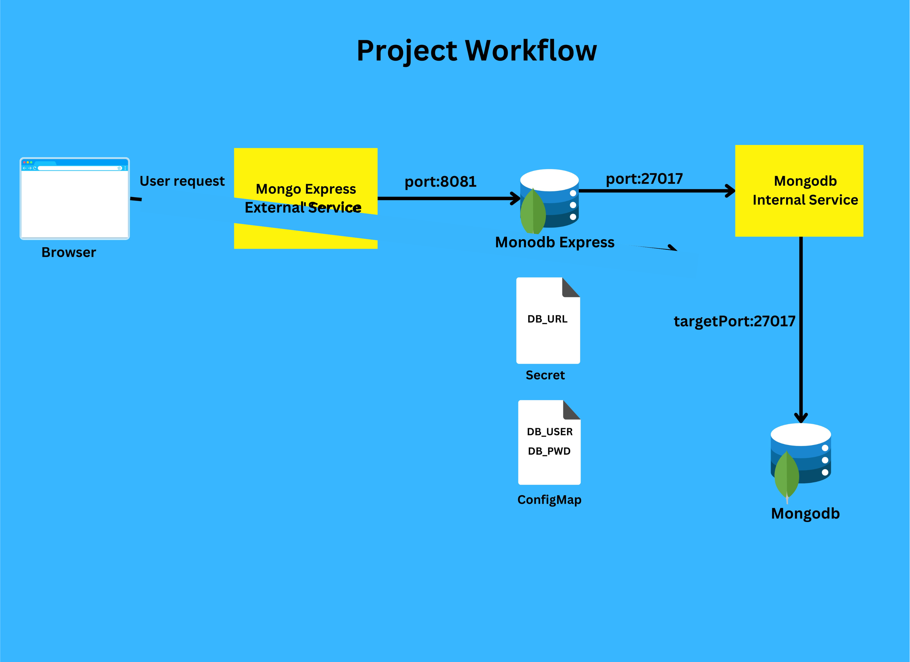

# Local Kubernetes Cluster Setup with Minikube

## Project Description

This project demonstrates how to set up a local Kubernetes (K8s) cluster using Minikube. It includes the deployment of MongoDB and MongoExpress, with configuration settings and credentials extracted into a ConfigMap and a Secret for enhanced security.

## Table of Contents

- [Prerequisites](#prerequisites)
- [Installation](#installation)
- [Usage](#usage)
- [Configuration](#configuration)
- [License](#license)

## Prerequisites

Before you begin, ensure you have met the following requirements:

- [Minikube](https://minikube.sigs.k8s.io/docs/start/) installed on your machine.
- [kubectl](https://kubernetes.io/docs/tasks/tools/) installed and configured to work with your Minikube cluster.

## Installation

1. **Start Minikube:**
   ```bash
   minikube start
   ```

2. **Clone this repository:**
   ```bash
   git clone https://github.com/otie16/Deploy-MongoDB-and-Mongo-Express-into-local-K8s-cluster.git
   cd your-repo
   ```

3. **Deploy MongoDB and MongoExpress:**
   - Create the ConfigMap and Secret:
     ```bash
     kubectl apply -f configmap.yaml
     kubectl apply -f secret.yaml
     ```

   - Deploy MongoDB and MongoExpress:
     ```bash
     kubectl apply -f mongo-deployment.yaml
     kubectl apply -f mongoexpress-deployment.yaml
     ```

## Usage

- To access MongoExpress, run:
  ```bash
  minikube service mongoexpress --url
  ```

  This will provide you with the URL to access MongoExpress in your browser.

## Configuration

- The MongoDB configuration settings are stored in a `ConfigMap`, and sensitive credentials are stored in a `Secret`. 

- Make sure to review the `configmap.yaml` and `secret.yaml` files to understand how the configurations are set up.

## License

This project is licensed under the MIT License - see the [LICENSE](LICENSE) file for details.
```
